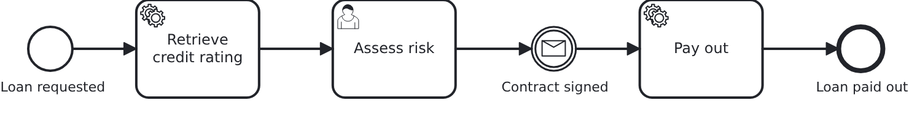
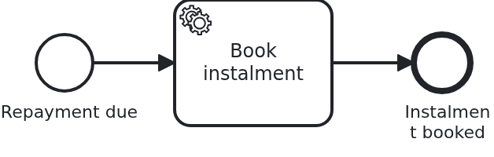

# Migrating running workflows to another BPMS

[](./LICENSE)

Moving to another BPMS is not a big-bang. Workflows are running, some of them for weeks, and
they were started in an engine which knows nothing about the one you are moving to. This
blueprint shows the answer VanillaBP gives: configure both, start new workflows in the new
one, and let every operation on an existing workflow find the engine holding it.

## What this blueprint shows



A loan approval which waits twice: at a user task, and behind it at a message. Two wait
states are the smallest model that shows the point, because answering either of them is an
operation which has to find the BPMS holding that workflow.

The module carries a second, much smaller workflow, and it is here for its configuration
rather than for its model:



The whole migration is configuration. Before it, one BPMS is configured as one adapter
instance:

```yaml
vanillabp:
  adapters:
    camunda7:
      # settings of that engine
```

During it, both are, in the order which decides where new workflows start:

```yaml
vanillabp:
  prioritized-adapters:
    - camunda8      # new workflows start here
    - camunda7      # workflows started earlier are still found here
  adapters:
    camunda8:
      rest-address: http://localhost:8080
    camunda7:
      # settings of that engine
  workflow-modules:
    loan-approval:
      workflows:
        loan_repayment:
          prioritized-adapters:
            - camunda7      # this one stays behind
```

Two rules route everything from there, and neither of them is visible in the code:

**A new workflow starts in the first adapter of the list.** Nobody is asked, because a
workflow which does not exist yet cannot be known to anybody.

**An operation on an existing workflow goes to the BPMS holding it.** Completing the user
task and correlating the message both ask the adapters in the order of the list, and the
first one which knows the workflow performs the operation. A loan approval started in the
old BPMS is therefore answered there, weeks after the new one became first priority.

The priority list exists on three levels, and the most specific non-empty one wins: per
adapter set, per workflow module, and per workflow. The repayment above uses the finest of
them, which is what makes a migration a workflow at a time instead of all at once.

Nothing in the Java code of this blueprint names an adapter, with one exception:
`/api/loan-approval/{id}/bpms` answers which BPMS runs a workflow, because showing the
routing is what this blueprint is for. It reads the id of the process definition the
workflow runs on, which is `<adapter-id>#<id of the BPMS>`, and returns its first part. An
application normally has no reason to ask.

## Delta to the base blueprint

Compared to [`module-single`](https://github.com/vanillabp-blueprints/module-single-springboot):

|            File             |                                              What is different                                               |
|-----------------------------|--------------------------------------------------------------------------------------------------------------|
| `application/pom.xml`       | the second profile brings BOTH adapters, because a migration is a state in which the old BPMS is still there |
| `application-camunda7.yaml` | the state before the migration: one adapter, nothing to prioritize                                           |
| `application-camunda8.yaml` | the state during it: the priority list, both adapters, and the workflow which stays behind                   |
| `application.yaml`          | a FILE database, because the scenario restarts the application                                               |
| `loan_approval.bpmn`        | a user task and a message catch event, the two wait states the election is shown with                        |
| `loan_repayment.bpmn`       | the second workflow, whose priority list names the old BPMS alone                                            |
| `loanrepayment/`            | its use case: the classes carry its name, because two use cases in one application would otherwise collide   |
| `MigrationIT.java`          | starts, routes and finishes workflows in both BPMS                                                           |
| `MigrationRestartIT.java`   | the migration itself: two boots, one database, the workflows of the first boot finished in the second        |

The user task alone is [`bpmn-user-task`](https://github.com/vanillabp-blueprints/bpmn-user-task-springboot),
the message alone is [`bpmn-message-correlation`](https://github.com/vanillabp-blueprints/bpmn-message-correlation-springboot).
Here they are the two wait states a migration has to survive.

Two use cases in one application need distinct bean names, which is why the repayment
classes are called `RepaymentService` and so on rather than `Service`. The general answer,
one bean-name generator per workflow module, is what
[`module-multi`](https://github.com/vanillabp-blueprints/module-multi-springboot) shows.

## Running it

Requires a JDK 21. The state before the migration needs nothing but the embedded engine:

```bash
mvn install verify
```

The migration state needs the remote engine, so a cluster has to run, and the profile brings
both adapters:

```bash
mvn install verify -Pcamunda8
```

The address of the cluster, and everything else specific to that engine, is in
`application/src/main/resources/application-camunda8.yaml`.

The database is a file, `target/database/loan-approval`, and that is the one place where
this blueprint differs from every other one in the catalogue. The scenario stops the
application, changes which BPMS are configured and starts it again, so the aggregates and
the tables of the embedded engine have to outlive the first run. `mvn clean` throws the
database away, which is how you start over.

### Walking through a migration

This is the sequence to show it to somebody, and it is what `MigrationRestartIT` does
without a browser.

Start with the old BPMS alone:

```bash
mvn -pl application spring-boot:run
```

Start a loan approval and take it past its user task:

```
http://localhost:8080/api/loan-approval/start
```

The log names the URL to answer the risk assessment, and after that the one to report the
signed contract. Answer the assessment and leave the workflow waiting for the message.
Start a second loan approval and leave that one at its user task. Both live in the old
BPMS:

```
http://localhost:8080/api/loan-approval/<id>/bpms
camunda7
```

Now stop the application and start it with both adapters:

```bash
mvn -pl application spring-boot:run -Pcamunda8
```

Start two more loan approvals and take one of them past its user task. They start in the
new BPMS, which the same URL shows:

```
http://localhost:8080/api/loan-approval/<id>/bpms
camunda8
```

Then answer the user task of the workflow left waiting in the old BPMS, and report the
signed contract for the one which was already waiting for it. Both finish, in the old BPMS,
while the two new ones finish in the new one. The URLs are the same for all four, and so is
the code behind them.

A repayment shows the finest level of the priority list. It starts in the old BPMS even
though loan approvals already start in the new one:

```
http://localhost:8080/api/loan-repayment/start
http://localhost:8080/api/loan-repayment/<id>/bpms
camunda7
```

While the application runs on Camunda 7, Camunda's own web applications are served at
`http://localhost:8080/camunda` with `demo` / `demo`, which is a second way to see where a
workflow lives.

## How it works

|                                          File                                          |                                            Role                                            |
|----------------------------------------------------------------------------------------|--------------------------------------------------------------------------------------------|
| `application/src/main/resources/application-camunda8.yaml`                             | the priority list, both adapters, and the workflow-level list of the repayment             |
| `application/src/main/resources/application-camunda7.yaml`                             | the same application with one BPMS, which is where a migration starts                      |
| `loan-approval/src/main/resources/loan-approval/processes/camunda7/loan_approval.bpmn` | the process with its two wait states                                                       |
| `.../loanapproval/Workflow.java`                                                       | `startWorkflow`, `completeUserTask` and `correlateMessage`, none of them naming an adapter |
| `.../loanapproval/Service.java`                                                        | the business code, plus the one method reading which BPMS holds a workflow                 |
| `.../loanrepayment/RepaymentWorkflow.java`                                             | the same `startWorkflow`, for the workflow which stays behind                              |
| `loan-approval/src/test/.../MigrationIT.java`                                          | both BPMS in one boot: where a workflow starts, and that every operation reaches it        |
| `application/src/test/.../MigrationRestartIT.java`                                     | two boots against one database, which is the migration                                     |

What VanillaBP does with the priority list, in the order it happens:

1. **Deployment.** The BPMN models of a workflow module are deployed to every adapter its
   lists name, so both engines are ready to serve their workflows.
2. **Start.** The first adapter of the list applicable to that workflow gets it.
3. **Every later operation.** VanillaBP asks the adapters in order whether they know the
   workflow. The first one saying yes performs the operation. An adapter which does not know
   it passes; an adapter which cannot be reached stops the operation with an error rather
   than letting the next one answer, because the unreachable one might be the one holding
   the workflow. A workflow already completed makes the operation a no-op with a warning,
   and if nobody knows it, a guiding exception says so.
4. **Remembering.** Successful elections are cached, and so is what VanillaBP knows without
   asking: after a start, and whenever a BPMS delivers something of that workflow. The cache
   is bounded and expiring, needs no configuration, and a lost record costs one extra round
   of asking rather than a wrong answer.

One setting of this blueprint is not a default and has a reason: `job-timeout: PT20S` on the
Camunda 8 adapter. A workflow started right after the application restarted waits for the lock of
its first job, because something took that job and never answered, and only the redelivery after the
lock expires reaches the worker which is open. The delay is exactly the lock, measured at both five
minutes and twenty seconds, and it is recorded as G25 in the monorepo's `GAPS.md`. Twenty seconds is
a lock the handlers of this blueprint can live with; five minutes would be five minutes of watching
nothing.

Two things are worth knowing before doing this against a real cluster. A remote BPMS may
answer from an eventually consistent read model, so a workflow started moments ago can be
unknown to it for a few seconds; VanillaBP keeps asking the adapter it recorded for as long
as that adapter says it may need. And two adapter ids of the same embedded engine would be
two engines, which must not share one set of engine tables: that needs a table prefix or a
data source of its own. This blueprint configures one instance per engine, so neither
applies here.

## Documentation

- [BPMS migration](https://github.com/vanillabp/adapter-platform-integration/wiki/BPMS-migration): the priority list, the election, the cache, and migrating between tenant setups
- [Configure the adapters](https://github.com/vanillabp/adapter-platform-integration/wiki/Spring-Boot-integration#configure-the-adapters): where adapter configuration lives and how it is bound
- [How name clashes are avoided](https://github.com/vanillabp/adapter-platform-integration/wiki/Workflow-modules#how-name-clashes-are-avoided): the same mechanism migrates a setup between two of these modes
- [Wire up a process](https://github.com/vanillabp/spi-for-java#wire-up-a-process): what the code in this blueprint does, without any of it knowing about a BPMS

This blueprint is developed in the monorepo
[`blueprints`](https://github.com/vanillabp-blueprints/blueprints). This repository is a
read-only mirror, **issues and pull requests belong there.**

## Noteworthy & Contributors

[VanillaBP](https://www.github.com/vanillabp/spi-for-java) was developed by [Phactum](https://www.phactum.at) with the
intention of giving back to the community as it has benefited the community in the past.


## License

Copyright 2026 Phactum Softwareentwicklung GmbH

Licensed under the Apache License, Version 2.0
